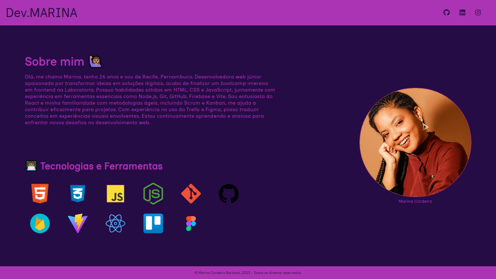

# Meu Projeto de Portfólio

Este é o repositório do meu projeto de portfólio/Carta de Apresentação, desenvolvido com HTML e CSS a paritr do curso de HTML5, CSS3 e JavaScript na prática da plataforma Udemy .

## Demonstração

Você pode visualizar o projeto ao vivo [aqui](https://marinacb7.github.io/Portfolio/).

## Capturas de Tela

## Tecnologias Utilizadas

- HTML
- CSS

## Autor

- Marina Cordeiro Barbosa
- [LinkedIn](https://www.linkedin.com/in/marinacb7/)
- Email: marinacordeiro92@gmail.com

## Licença

Este projeto está sob a licença MIT - consulte o arquivo [LICENSE](LICENSE) para obter mais detalhes.
